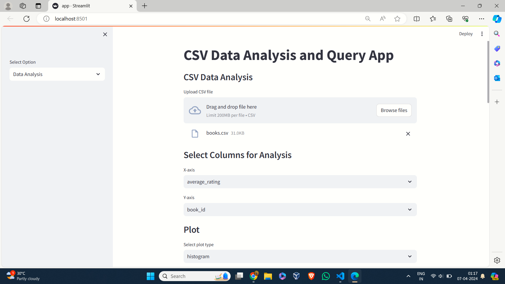

# statistal analysis of csv
# [`Demo video`](https://drive.google.com/file/d/1Y9nTQh4CJlW5X92kkv6xtByOXZ518734/view?usp=sharing)

## This project is done as part of TensorGo assignment 

## Installation guide
Clone the Repository
  ```
  git clone https://github.com/srinivastls/assign.git
  ```


Add OpenAI key 
```
os.environ["OPENAI_API_KEY"] = "your key"
in the  place of your key
```
Run the stream app
```
streamlit run app.py
```
------------------------------------------
Functionality 
- The application provides many functionalities such as giving insights of mean median , mode of various columns
  
- you can also do data analysis without llm
  
